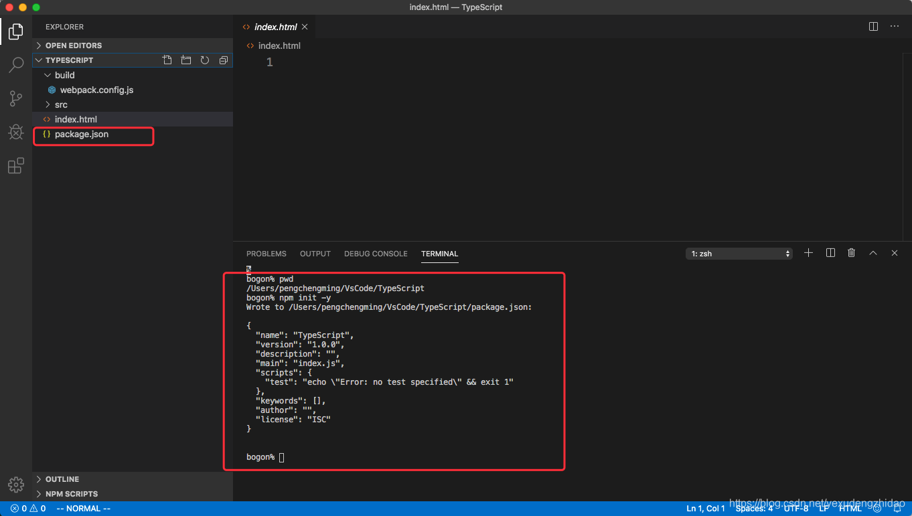
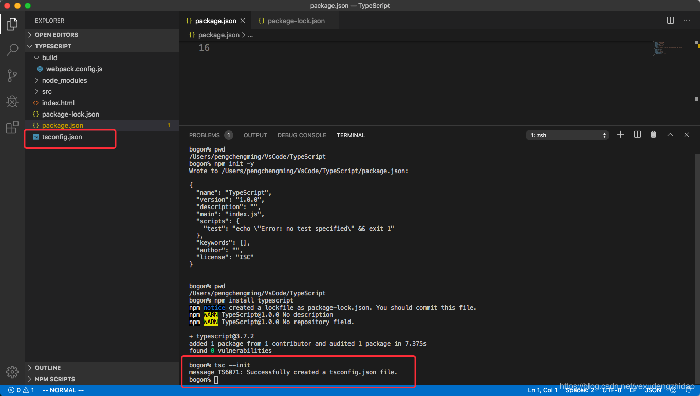
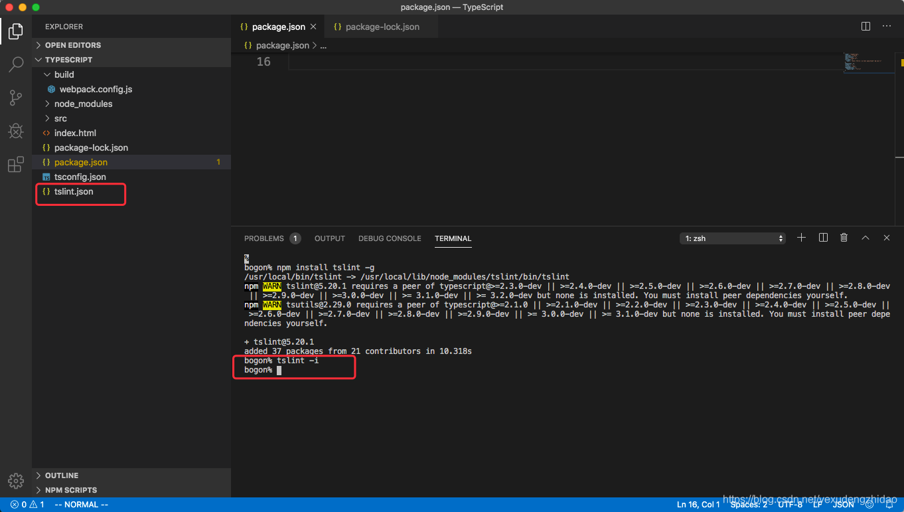

### 一，项目环境的基础配置

#### 1，创建一个简单的项目结构目录结构

```xml
  │ index.html
  ├─build
  │      webpack.config.js
  └─src
          main.ts
```

目录和文件夹分析：

- index.html是跑浏览器上的模块文件
- build文件夹中用于存放webpack的配置信息
- src用于存放之后编写的所有TypeScript代码

#### 2，使用npm管理项目的依赖

    webpack本身需要有很多的依赖，并且之后我们也需要启动node服务来快速浏览index.html模板以及编译后的JavaScript代码。


```sh
# 使用npm来初始化package.json文件：
npm init -y
```



#### 3，本地依赖TypeScript

为什么需要本地依赖TypeScript：

- 因为我们之后是通过webpack进行编译我们的TypeScript代码的，并不是通过tsc来完成的。（tsc使用的是全局安装的TypeScript依赖）

- 那么webpack会在本地去查找TypeScript的依赖，所以我们是需要本地依赖TypeScript的；

```sh
# 安装本地TypeScript依赖
npm install typescript
```

#### 4，初始化tsconfig.json文件

在进行TypeScript开发时，我们会针对TypeScript进行相关的配置，而这些配置信息是存放在一个tsconfig.json文件中的，我们并不需要手动去创建它，可以通过命令行直接来生成这样的一个文件：

```sh
tsc --init
```



#### 5，配置tslint来约束代码

为了让大家按照严格的TypeScript风格学习代码，希望可以加入tslint

```sh
# 全局安装tslint：
npm install tslint -g

# 在项目中初始化tslint的配置文件：tslint.json
tslint -i
```



### 二，项目环境的Webpack

#### 1，安装webpack相关的依赖

```sh
# 使用webpack开发和打包，需要依赖webpack、webpack-cli、webpack-dev-server
npm install webpack webpack-cli webpack-dev-server -D
```

#### 2，在package.json中添加启动命令

```json
# 为了方便启动webpack，我们在package.json中添加如下启动命令
"scripts": {
"test": "echo \"Error: no test specified\" && exit 1",
"serve": "cross-env NODE_ENV=development webpack-dev-server --mode=development --config build/webpack.config.js"
},
```

#### 3，添加webpack的其他相关依赖

```sh
# 依赖一：cross-env
# 这里我们用到一个插件 “cross-env” ，这个插件的作用是可以在webpack.config.js中通过 process.env.NODE_ENV 来获取当前是开发还是生产环境，我们需要这个插件：
npm install cross-env -D

# 依赖二：ts-loader
# 因为我们需要解析.ts文件，所以需要依赖对应的loader：ts-loader
npm install ts-loader -D

# 依赖三：html-webpack-plugin
# 编译后的代码需要对应的html模块作为它的运行环境，所以我们需要使用html-webpack-plugin来将它插入到对应的模板中：
npm install html-webpack-plugin -D
```

#### 4，配置webpack.config.js文件

将如下配置到webpack.config.js文件中:

```js
const HtmlWebpackPlugin = require("html-webpack-plugin");

module.exports = {
  entry: "./src/main.ts",
  output: {
    filename: "build.js"
  },
  resolve: {
    extensions: [".tsx", ".ts", ".js"]
  },
  module: {
    rules: [
      {
        test: /\.tsx?$/,
        use: "ts-loader",
        exclude: /node_modules/
      }
    ]
  },
  devtool: process.env.NODE_ENV === "production" ? false : "inline-source-map",
  devServer: {
    contentBase: "./dist",
    stats: "errors-only",
    compress: false,
    host: "localhost",
    port: 8080
  },
  plugins: [
    new HtmlWebpackPlugin({
      template: "./index.html"
    })
  ]
};
```

### 三，代码测试

- 在终端中启动服务：

  ```sh
  npm run serve
  ```

- 在浏览器中打开：http://localhost:8080/，修改代码，直接可以看到修改后的效果：不需要手动进行任何刷新
