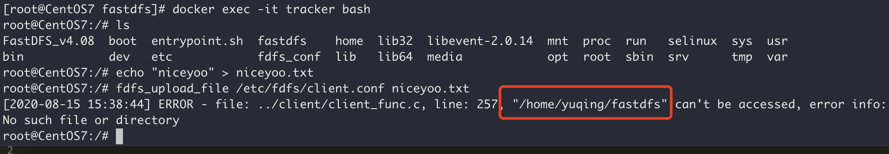

## 一，docker安装

虚拟化容器技术，基于镜像。秒启各种容器，每一个容器就是一个完整地运行环境，环境之间相互隔离；

### 1.1，docker安装

外国镜像地址：https://hub.docker.com/

docker安装地址：https://docs.docker.com/install/linux/docker-ce/centos/

1. 卸载老版本

   ```sh
   sudo yum remove docker \
                     docker-client \
                     docker-client-latest \
                     docker-common \
                     docker-latest \
                     docker-latest-logrotate \
                     docker-logrotate \
                     docker-engine
   ```

2. 安装依赖包

   ```sh
   sudo yum install -y yum-utils \
     device-mapper-persistent-data \
     lvm2
   ```

3. 从那个仓库下载

   ```sh
   sudo yum-config-manager \
       --add-repo \
       http://mirrors.aliyun.com/docker-ce/linux/centos/docker-ce.repo
   ```


4. 安装docker管理工具

   ```sh
   sudo yum install docker-ce docker-ce-cli containerd.io docker-compose-plugin
   ```

5. 启动docker

   ```sh
   sudo systemctl start docker
   ```

6. 查看docker有哪些镜像

   ```sh
   sudo docker images
   ```

7. 设置docker自启动

   ```sh
   sudo systemctl enable docker
   ```

8. 配置docker镜像加速

   镜像默认是国外的太慢了，使用国内的阿里云加速；下面是找到那段加速代码的方式

   登陆阿里云-》控制台-》左侧产品与服务-》容器镜像服务-》镜像加速器-》可以找到如下代码

    1. 创建文件

       ```sh
       sudo mkdir -p /etc/docker
       ```

    2. 执行命令

       ```sh
       sudo tee /etc/docker/daemon.json <<-'EOF'
       {
         "registry-mirrors": ["https://kbhu3ofq.mirror.aliyuncs.com"]
       }
       EOF
       ```

    3. 执行命令

       ```
       sudo systemctl daemon-reload
       sudo systemctl restart docker
       ```

    4. docker仓库地址

       ```sh
       hub.docker.com
       ```

### 1.2，安装mysql镜像

1. 拉取镜像

   ```sh
   docker pull mysql:5.7
   ```

2. mysql启动参数配置

   ```sh
   docker run -p 3306:3306 --name mysql \
   -v /usr/local/mysql/log:/var/log/mysql \
   -v /usr/local/mysql/data:/var/lib/mysql \
   -v /usr/local/mysql/conf:/etc/mysql \
   -e MYSQL_ROOT_PASSWORD=root \
   -d mysql:5.7
   
   参数说明：
   	-p 3306:3306：将容器的3306端口映射到主机的3306端口
   	-v /usr/local/mysql/conf:/etc/mysql：将配置文件夹挂载到主机
   	-v /usr/local/mysql/log:/var/log/mysql：将日志文件夹挂载到主机
   	-v /usr/local/mysql/data:/var/lib/mysql：将数据文件夹挂在到主机
   	-e MYSQL_ROOT_PASSWORD=root：初始化 root 用户的密码
   ```

3. 查看镜像

   ```sh
   docker ps
   docker images
   docker rm
   ```

4. 进入docker镜像中装的mysql里

   ```sh
   docker exec -it mysql /bin/bash
   ```

5. 更改mysql配置

   ```sh
   vi /usr/local/mysql/conf/my.cnf
   ```

6. mysql相关配置

   ```sh
   [client]
   default-character-set=utf8
   [mysql] 
   default—character—set=utf8
   [mysqld]
   init_connect=’SET collation_connection = utf8_Unicode_ci'
   init_connect=’SET NAMES utf8’
   character-set-server=utf8
   collation-server=utf8_unicode_ci
   skip-character-set-client-handshake
   skip-name-resolve
   ```


7. 重启容器

   ```sh
   docker restart mysql
   ```

8. 建库

   ```sql
   CREATE DATABASE gulimall_oms CHARACTER SET utf8 COLLATE utf8_general_ci;
   CREATE DATABASE gulimall_pms CHARACTER SET utf8 COLLATE utf8_general_ci;
   CREATE DATABASE gulimall_sms CHARACTER SET utf8 COLLATE utf8_general_ci;
   CREATE DATABASE gulimall_ums CHARACTER SET utf8 COLLATE utf8_general_ci;
   CREATE DATABASE gulimall_wms CHARACTER SET utf8 COLLATE utf8_general_ci;
   CREATE DATABASE gulimall_admin CHARACTER SET utf8 COLLATE utf8_general_ci;
   CREATE DATABASE nacos_config CHARACTER SET utf8 COLLATE utf8_general_ci;
   ```


### 1.3，安装Redis镜像

1. 拉取redis镜像

   ```sh
   docker pull redis
   ```

    * 查看镜像latest的具体版本号

      ```sh
      docker image inspect (docker image名称):latest|grep -i version
      ```


2. redis配置

   ```sh
   mkdir -p /usr/local/redis/conf
   touch /usr/local/redis/conf/redis.conf
   ```


3. redis配置

   反斜杠代表的是换行的意思 注意它两边是有换行的

    ```sh
   docker run -p 6379:6379 --name redis \
   -v /usr/local/redis/data:/data \
   -v /usr/local/redis/conf/redis.conf:/etc/redis/redis.conf \
   -d redis redis-server /etc/redis/redis.conf
    ```


4. 进入redis客户端

   ```sh
   docker exec -it redis redis-cli
   ```


5. 在 /usr/local/redis/conf/redis.conf添加持久操作

   ```
   appendonly yes
   ```


6. 设置容器自动启动

   ```sh
   sudo docker update redis --restart=always
   ```

### 1.4，安装Nacos镜像

[Docker安装nacos 并配置docker中的mysql_独木舟不过江的博客-CSDN博客](https://blog.csdn.net/dumuzhouguohe/article/details/123390684)

```sh
docker run -d --name nacos -p 8848:8848 --privileged=true -e JVM_XMS=256m -e JVM_XMX=256m -e MODE=standalone -v /usr/local/nacos/logs/:/home/nacos/logs -v /usr/local/nacos/conf/:/home/nacos/conf/ nacos/nacos-server:1.1.4
```

### 1.5，安装Nginx镜像

```shell
# 创建挂载目录
mkdir -p /usr/software/nginx/conf
mkdir -p /usr/software/nginx/log
mkdir -p /usr/software/nginx/html


# 生成容器
docker run --name nginx -p 9001:80 -d nginx
# 将容器nginx.conf文件复制到宿主机
docker cp nginx:/etc/nginx/nginx.conf /usr/software/nginx/conf/nginx.conf
# 将容器conf.d文件夹下内容复制到宿主机
docker cp nginx:/etc/nginx/conf.d /usr/software/nginx/conf/conf.d
# 将容器中的html文件夹复制到宿主机
docker cp nginx:/usr/share/nginx/html /usr/software/nginx/


docker run -p 80:80 --name nginx \
-v /usr/software/nginx/html:/usr/share/nginx/html \
-v /usr/software/nginx/logs:/var/log/nginx \
-v /usr/software/nginx/conf/nginx.conf:/etc/nginx/nginx.conf \
-v /usr/software/nginx/conf/conf.d:/etc/nginx/conf.d \
-d nginx:1.25.3

```

### 1.6，安装MongoDB镜像

```shell
#拉取mongo镜像
docker pull mongo:7.0.5

#创建mongo数据持久化目录
mkdir -p /usr/software/mongodb/data

#运行容器
#–auth：需要密码才能访问容器服务
docker run -itd --name mongo -v /usr/software/mongodb/data:/data/db -p 27017:27017 mongo:7.0.5 --auth

#进入创建的MongoDB容器
docker exec -it mongo mongosh

# 进入admin数据库 
use admin 
# 创建一个超级用户 
db.createUser({user:"root",pwd:"root",roles:[{role:"root",db:"admin"}]});
#测试连接mongo数据库
db.auth('root','root')

```

### 1.7，安装RabbitMQ镜像

```shell
docker run -d --name rabbitmq -p 5672:5672 -p 15672:15672 -v /usr/rabbitmq/conf:/etc/rabbitm -v /usr/rabbitmq/data:/var/lib/rabbitmq -v /usr/rabbitmq/log:/var/log/rabbitmq -e RABBITMQ_DEFAULT_USER=admin -e RABBITMQ_DEFAULT_PASS=admin rabbitmq:3.12-management
```

### 1.8，安装AList镜像

[一个支持多种存储的文件列表程序]: https://alist.nn.ci/zh/

```shell
docker run -d -v /usr/software/alist:/opt/alist/data -p 5244:5244 -e PUID=0 -e PGID=0 -e UMASK=022 --name="alist" xhofe/alist:latest
```

### 1.9，FastDFS文件系统

1. 拉取镜像

   ```sh
   # 拉取FastDFS镜像，该镜像包含tracker和storage
   #latest版的里面没有nginx（坑）
   docker pull season/fastdfs:1.2
   ```


2. 创建存放文件的目录

   ```sh
   # -p 代表递归创建没有的目录
   mkdir -p /usr/software/fastdfs/tracker/data
   mkdir -p /usr/software/fastdfs/storage/data
   mkdir -p /usr/software/fastdfs/storage/path
   mkdir -p /usr/software/fastdfs/nginx
   ```


3. 创建 tracker 容器（跟踪服务器容器）

   ```sh
   docker run -id --name tracker \
   -p 22122:22122 \
   --net host \
   -v /usr/software/fastdfs/tracker/data:/fastdfs/tracker/data \
   season/fastdfs:1.2 tracker
   ```

4. 修改 tracker 容器中的 client.conf 配置文件

   ```sh
   docker cp tracker:/etc/fdfs/client.conf /usr/software/fastdfs/
   # 修改client.conf 文件的 tracker服务器ip地址
   # tracker_server=192.168.92.128:22122
   vim /usr/software/fastdfs/client.conf
   
   docker cp /usr/software/fastdfs/client.conf tracker:/etc/fdfs
   
   
   ```


5. 创建 storage 容器（存储服务器容器），注意修改ip

   ```
   docker run -id --name storage \
   --net host \
   -v /usr/software/fastdfs/storage/path:/fastdfs/store_path \
   -e TRACKER_SERVER="192.168.92.128:22122" \
   season/fastdfs:1.2 storage
   ```


6. 配置 Ngnix

    - 将 storage 容器中的 nginx 配置文件复制出来

      ```sh
      docker cp storage:/etc/nginx/conf/nginx.conf /usr/software/fastdfs/nginx/
      ```


- 修改 nginx 中的配置

  ```sh
  vim /usr/software/fastdfs/nginx/nginx.conf
  
  
  # 修改Nginx配置文件的内容
  location / {
      root /fastdfs/store_path/data;
      ngx_fastdfs_module;
  }
  ```

- 创建并启动 nginx 容器

  ```sh
  docker run -id --name fastdfs_nginx \
  -v /usr/software/fastdfs/storage/path:/fastdfs/store_path \
  -v /usr/software/fastdfs/nginx/nginx.conf:/etc/nginx/conf/nginx.conf \
  -p 8888:80 \
  -e TRACKER_SERVER=192.168.92.128:22122 \
  season/fastdfs:1.2 nginx
  ```

7. 测试

    - 执行命令，进入 tracker 容器中

      ```sh
      docker exec -it tracker bash
      ```


- 随便创建一个 txt 文件

  ```sh
  echo "dangdangdang" > dangdangdang.txt
  ```


- 然后通过 fdfs_upload_file 命令将 dangdangdang.txt 文件上传至服务器

  ```shell
  fdfs_upload_file /etc/fdfs/client.conf dangdangdang.txt
  ```

- 如果此时报了如下错误

  

  创建一下对应的路径，没有的跳过

  ```sh
  mkdir -p /home/yuqing/fastdfs
  ```


### 1.10，Elasticsearch镜像

#### 1.10.1，基于Docker安装Elasticsearch

1. 创建网络

   ```shell
   # 因为需要部署kibana容器，因此需要让es和kibana容器互联
   docker network create es-net
   ```

2. 拉取镜像

   ```shell
   # 以安装Elasticsearch 8.6.0 版本为例
   docker pull elasticsearch:8.6.0
   ```

3. 创建挂载点目录

   ```shell
   mkdir -p /usr/software/es/data /usr/software/es/config /usr/software/es/plugins
   
   chmod 777  /usr/software/es/data
   chmod 777  /usr/software/es/config
   chmod 777  /usr/software/es/plugins
   ```

4. 不熟单点es，创建es容器

   ```shell
   docker run -d \
   --name es \
   --network es-net \
   -p 9200:9200 \
   -p 9300:9300 \
   --privileged \
   -v /usr/software/es/data:/usr/share/elasticsearch/data \
   -v /usr/software/es/plugins:/usr/share/elasticsearch/plugins \
   -e "discovery.type=single-node" \
   -e "ES_JAVA_OPTS=-Xms512m -Xmx512m" \
   elasticsearch:8.6.0
   ```

5. 编写elasticsearch.yml

   ```shell
   # 先进入es容器
   docker exec -it es /bin/bash
   
   # 跳转到config目录下
   cd config
   
   # 关闭密码安全验证
   echo 'xpack.security.enabled: false' >> elasticsearch.yml
   ```

6. 重启es容器

   ```shell
   docker restart es
   ```

7. 测试Elasticsearch是否安装成功

   ```shell
   # 访问虚拟机地址+端口号，前面配置Elasticsearch 的端口号为：9200，例如：
   http://192.168.92.128:9200
   ```

#### 1.10.2，基于Docker安装Kibana

1. 拉取镜像

   ```shell
   # 以安装kibana 8.6.0 版本为例
   docker pull kibana:8.6.0
   ```

2. 创建挂载点目录

   ```shell
   mkdir -p /usr/software/kibana/config /usr/software/kibana/data
   
   chmod 777 /usr/software/kibana/data
   chmod 777 /usr/software/kibana/config
   ```

3. 不熟Kibana，创建Kibana容器

   ```shell
   docker run -d \
   --name kibana \
   --network es-net \
   -p 5601:5601 \
   -e ELASTICSEARCH_HOSTS=http://es:9200 \
   kibana:8.6.0
   ```

4. 测试Kibana是否安装成功

   ```shell
   # 访问虚拟机地址+端口号，前面配置Kibana 的端口号为：5601，例如：
   http://192.168.92.128:5601
   ```

5. 如果出现“This Elastic installation has strict security requirements enabled that your current browser does not meet.“提示

   ```shell
   # 先进入es容器
   docker exec -it kibana /bin/bash
   
   # 跳转到config目录下
   cd config
   
   # kibana.yml配置文件中增加
   csp.strict: false
   ```


#### 1.10.3，基于Docker安装IK分词器

1. 进入Elasticsearch容器

   ```shell
   docker exec -it es /bin/bash
   ```

2. 在线安装IK分词器

   ```shell
   # 注意：安装IK分词器的版本，必须和Elasticsearch的版本一致，上文安装的是Elasticsearch 8.6.0的，所以接下来安装的IK分词器版本是8.6.0
   ./bin/elasticsearch-plugin install https://github.com/medcl/elasticsearch-analysis-ik/releases/download/v8.6.0/elasticsearch-analysis-ik-8.6.0.zip
   
   # 如果需要安装其他版本的IK分词器，需要把版本号修改即可
   # 如：
   # ./bin/elasticsearch-plugin install https://github.com/medcl/elasticsearch-analysis-ik/releases/download/v7.4.2/elasticsearch-analysis-ik-7.4.2.zip
   # ./bin/elasticsearch-plugin install https://github.com/medcl/elasticsearch-analysis-ik/releases/download/v8.6.0/elasticsearch-analysis-ik-8.6.0.zip
   ```


#### 1.10.4，基于Docker安装Head插件

1. 拉取镜像并启动

   ```shell
   docker pull mobz/elasticsearch-head:5
   
   docker run --name elasticsearch-head -di -p 9100:9100 docker.io/mobz/elasticsearch-head:5
   ```

2. 连接Elasticsearch

    - 网页打开ElasticSearch-head页面：宿主机ip:9100
    - 连接es，宿主机ip:9200

3. 遇到的问题及解决方案

   ```yaml
   # 修改ES根目录下配置文件vi config/elasticsearch.yml加入2个参数，并重启
   http.cors.enabled: true
   http.cors.allow-origin: '*'
   # 参数说明：
   #参数 缺省值 说明
   # http.cors.enabled true 如果启用了 HTTP 端口，那么此属性会指定是否允许跨源 REST 请求。
   # http.cors.allowed.origin localhost 如果 http.cors.enabled 的值为 true，那么该属性会指定允许 REST 请求来自何处。
   ```
